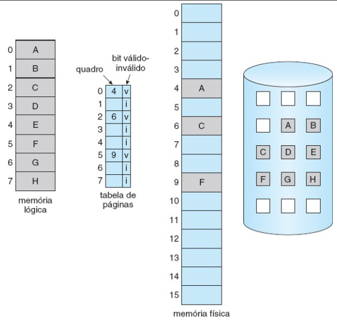
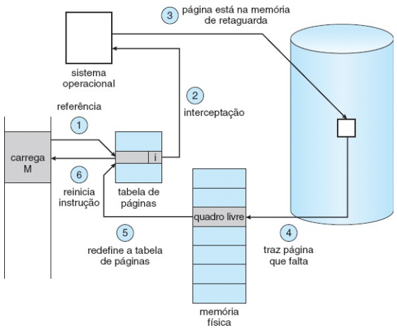

# Memória Virtual

- Paginação por demanda
- segmentação por demanda

## Paginação por demanda

- Pagina somente quando necessita
- Vantajosa pq precisa de um menor número de informações E/S
- Resposta mais rápida
- Menor ocupação de memória
- Mais usuários

**Quando vai buscar uma página**
- referência inválida -> interrupção e erro
- Se a página está carregada em disco, carrega a imagem na memória

  
  

**Desenpenho sistema paginação por demanda**

$$ t_{ea}=(1-p)t_{mem}+p(t_{page\_fault}+t_{swap\_in}+t_{swap\_out}+t_{restart}) $$ 
<- terminar

**Substituição de páginas**

- Caso não exista um frame livre na memória
  - Terminar o processo
  - Escolher um processo e colocá-lo na memória secundária
  - Escolher uma página e substituí-la

## Algoritmos de substituição de páginas

- kVMTrace
- VMTrace

**Reference trace** -> Sequência de referências a páginas acessadas pelo processo

### **FIFO**
  - Cada página tem um tempo associado relativo ao instante em que foi carregado na memória
  - Considerações:
    - Fácil de implementar
    - a página substituída pode ser de um módulo carregado que não está mais sendo utilizado
    - Variável inicializada no início daexecução sendo acessada constantemente
    - garante não haver loop
      - load M
      - busca load na memória
      - busca M na memória e coloca na página q tinha o load
      - reestarta o PC

  - **Anomalia de Belady:** A taxa de falhas pode aumentar com o aumento do número de frames

### **Algoritmo ótimo**

- Menor taxa de falhas
- Subtitua a página que não será utilizada pelo maior período de tempo
- Este algoritmo garante a menor taxa de falhas de páginas para um conjunto número de frames
- **Problema:** Não tem como saber qual página não será utilizada no futuro

### **LRU**

- A página que será substituída é a que está há mais tempo sem ser referenciada
- Não tem anomalia de belady

### **Algoritmos aproximados de LRU**

- **Bit de referência**
  - Tem apoio de hardware
    - Processadores implementam um "bit de acesso", que é setado toda vez que a página é acessada (na tabela de páginas)
  - De tempos em tempos, limpar as referências de acesso (voltar o valor para 0)

- **Bit de referência adicional**
  - utilização de 8 bits
  - A cada intervalo de tempo, o SO desloca o bit para a direita (para a parte alta do bit)
  - Histórico de utilização dos últimos 8 períodos de tempo

- **Algoritmo da segunda chance (relógio)**
  - Similar ao FIFO
  - Se o bit de referência da vítima está ligado, não remove essa página da memória, desliga o bit (para evitar entrar em loop) e passa para a próxima página

- **Segunda chance melhorado**
  - Considera o bit de referência e o bit de modificação
  - FIFO + bit de referência + bit modifficado
    - bit modificado indica se a página foi alterada ou n
    - Se a página não foi modificada, não é necessário escrever ela no disco novamente, só precisa trazer a nova página
  - (0, 0): não foi recentemente utilizado nem modificado
  - (0, 1): Não foi recentemente utilizado, mas foi modificado
  - (1, 0): recentemente utilizado porém não modificado
  - (1, 1): recentemente utilizado e modificado
  - Utiliza o mesmo algoritmo de relógio porém da prioridade para as páginas não acessadas e não modificadas (ordem de prioridade é o menor em binário, mesma sequência acima $\uparrow$)

### **Algoritmos de contagem**
- Associar para cada página um contador, que armazena o número de acessos à página
- Algoritmo menos frequentemente utilizado (LFU)
  - Substitui a página com o menor contador
- Algoritmo mais frequentemente utilizado (MFU)
  - Substitui a página com o maior contador
- Não implementado pq é mt custoso e não se aproxima do algoritmo ótimo

### **Utilização de buffers de página**

- Manter sempre o conjunto de frames livres, assim quando uma falha de página ocorre ela é carregada no frame livre enquanto a página vítima é escrita no disco
- Mantem uma lista de páginas modificadas
  - Quando o disco estiver ocioso, as páginas são escritas no disco
  - Aumenta a probabilidade de um frame com o bit modificado em 0

### **Alocação de frames**

- A partir de um número **m** de frames livres qual número de frames que serão alocados para os processos em execução
- Número mínimo de frames que devem ser alocados é determinado pelo conjunto de instruções
  - Instruções que acessam somente um endereço por instrução: 2 páginas (1 intrução + 1 dado)
  - referências indiretas: load M -> 3 frames

### **Algoritmos de alocação**

**Alocação igualitária:**
- **m** frames com **n** processos em execução
- **m**/**n**: alocação igualitária

**Alocação proporcional**
- Número de frames disponíveis **m**. Alocação de $a_i$ frames para o processo pi, onde a ai é determinado por
  - $a_i = (s_i/S)*m$
- Novo processo entra em execução -> realiza cálculo novamente
- Envolve prioridade, número de taxa de falhas e não somente o tamanho
  - Alocar 3G no inicio da main e não usar

### **Trashing**

- Alta atividade de paginação
- O tempo gasto para paginação é maior que a execução
- CPU tem baixa utilização pq os processos ficam esperando as páginas serem carregadas
- SO monitora o estado do sistema
  - casp a utilização seja baixa, aumenta o grau de multiprogramação do sistema
  - mais processos executando -> maior necessidade de memória -> aumento do número de falhas de páginas
- **Única solução é comprar mais memória física**

### **Conjunto de trabalho (working set model)**
- Janela de conjunto de trabalho
- Para determinar quantos frames serão dados ao processo
- Da pra implementar como bit de referência
- Questão é qual o tamanho da janela

### **Buddy system**
- Alocação da memória a partir de segmentos de tamanho fixo
- Memória alocada de tamanho $2^n$
  - Uma requisição é arredondada para um tamanho de $2^n$
  - Quando um tamanho menor deve ser alocado, um segmento maior é dividido na metade
    - Continua até que o tamanho desejado seja obtido
- Quebra ou junção de segmentos da memória de forma dinâmica

### **Slab Allocator**

- Estratégia alteranativa para alocação de memória do kernel
- Aloca previamente conjuntos determinados de memória
  - Tem objetos de tamanhos diferentes
- **Slab:** uma ou mais páginas físicamente contíguas
- **Cache:** uma ou mais Slabs
- Cache única para cada estrutura de dados do kernel