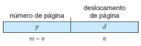
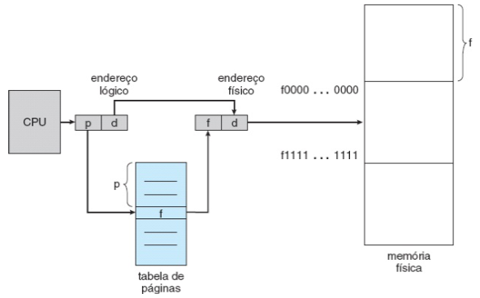

# Métodos de alocação

## a) Alocação contígua

armazena de forma contígua na memória, como se fosse um array sequêncial

**registrador de realocação:** (diz onde começou o armazenamento físico para calcular o endereço lógico)

**Limite:** quantidade máxima de endereços que o programa pode gerar

vantagens:
- simples

desvantagens:
- Ter o espaço disponível, mas não de forma contígua (memória mal aproveitada)

### Problema da alocação dinâmica

decidir **como** colocar os programas na memória

a) fisrt fit: Aloca no primeiro espaço disponível q tiver \
b) best fit: Busca todos os espaços disponíveis e escolhe o que está mais próximo do tamanho do processo. (os espaços livres e acaba segmentando muito a memória) \
c) worst fit: Busca todos os espaços e escolhe o que sobra mais espaço

os estudos mostram que compensa usar o first fit msm, pois os outros métodos não apresentam muitos ganhos

### Compactação de memória ou desfragmentação

Consiste em realocar os processos para obter um espaço livre contiguo

pra fazer esse processo, é preciso congelar o sistema, atualizar os contextos e depois liberar

## b) Segmentação

alocação => visão de programador

o programa passa a ter um segmento e não um bloco

não se pode quebrar um segmento, mas podem estar divididos na memória

CPU deixa de mandar só o endereço e passa a mandar uma tupla de segmento e endereço

## c) Paginação

- divide o end lógico em páginas de tamanho fixo
- A memória é dividida em frames, onde $tamanho\_frame = tamanho\_paginas$
- **A PÁGINA deve ser contigua**
- **Cada processo deve ter a sua própria tabela de páginas**
- as paǵinas pode ser alocadas de forma não contígua
  
  
- $2^n = tamanho da página$
- tradução de end lógico para físico

 

Ex: computador de 4 bits de memória, end byte a byte

- tamanho da pag = 2 bits

a) Quantos bytes tem cada página?
**R:.** 4 bytes

b) Quantas entradas tem a tab de páginas?
**R:.** 4 entradas -> 4 páginas

c) Faça a tradução de end lógico p físico do processo P1

  1) 10
    **R:.** 1010 -> 10|10 -> 11|10
  2) 5
    **R:.** 0101 -> 01|01 -> 10|01
  3) 0
    **R:.** 0000 -> 00|00 -> 01|00

**Espaço de end lógico do processo**
| end  | dado |
| ---- | ---- |
| 0000 | A    |
| 0001 | B    |
| 0010 | C    |
| 0011 | D    |
| 0100 | E    |
| 0101 | F    |
| 0110 | G    |
| 0111 | H    |
| 1000 | I    |
| 1001 | J    |
| 1010 | K    |
| 1011 | L    |
| 1100 | M    |
| 1101 | N    |
| 1110 | O    |
| 1111 | P    |

**Memória Física**
| end  | dado |
| ---- | ---- |
| 0000 | M    |
| 0001 | N    |
| 0010 | O    |
| 0011 | P    |
| 0100 | A    |
| 0101 | B    |
| 0110 | C    |
| 0111 | D    |
| 1000 | E    |
| 1001 | F    |
| 1010 | G    |
| 1011 | H    |
| 1100 | I    |
| 1101 | J    |
| 1110 | k    |
| 1111 | L    |

**Tabela de páginas**
| pag | frame |
| --- | ----- |
| 00  | 01    |
| 01  | 10    |
| 10  | 11    |
| 11  | 00    |

### Informações adicionais da tabela de páginas

- bit válido/inválido
- permissões: leitura, escrita, execução

### TLB (translation lookaside buffer): cache da tabela de páginas
- pequena
- tupla de página frame
- tipicamente de 16 a 512 entradas
- totalmente associativas -> não tem partições, resolve em um único ciclo
- Se não estiver na TLB, vai na memória e traz o dado pra TLB

com TLB $\alpha$ = taxa de acerto da TLB \
$T_{md}$ = $\alpha$ * ($T_{TLB} + T_m$) + (1-$\alpha$) * ($T_{TLB} + 2*T_m$)

Tm = 100ns
$T_{TLB}$ = 15ns
$\alpha$ = 0.9

$T_{md}$ = 0.9 * (15 + 100) + (1-0.9) * (15 + 2*100) 
= 0.9 * 115 + 0.1 * 215 
= 103.5 + 21.5
= 125ns

Processador de 32 bits -> tamanho da página 4096 bytes

- Quantas entradas tem a tabela de páginas?\
  $2^n = 4096$ -> $n=12$\
  12 bits para o deslocamento e 20 bits para o endereço da página\
  $2^20 = 1Mega$ de entradas 
- Qual o tamanho da tabela de páginas? Considerar que cada linha tem 4 bytes.\
  1 (quantidade de entradas) * 4 (bytes por linha) = 4MB

### Paginação multinível

10 | 10 | 12 

quantas entradas na TP de 1º nível?\
$2^{10} = 1024$

Qual o tamanho da TP? 

**Tabelas de segundo nível só são alocadas quando é necessário**

$T_{md}$ = $\alpha$ * ($T_{TLB} + T_m$) + (1-$\alpha$) * ($T_{TLB} + (N\_niveis+1)*T_m$)

### Hash

Risco de colisão -> pouco usado

### Tabela de páginas invertida

Tabela de páginas tem o mesmo número de frames da memória

Mantem a tabela de tamanho constante e não cresce com o número de processos