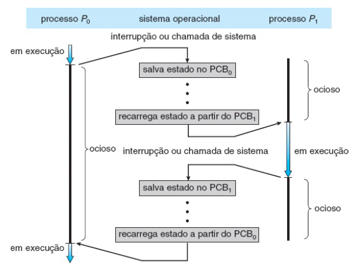
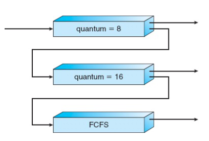

# Gerenciamento de Processos

  **Processo é um programa em execução**
  
  - PCB process control block
    - task struct (sched.h) no linux
      - pid
      - alocação de memória
      - arquivos abertos
      - segurança (dono do processo, grupo, privilégios)
      - accounting (contabilidade -> utilização de cpu, memória, disco, rede, ...)
      - estado dos registradores
    - estrutura de dados que armazena as informações de um processo
    - contexto: estado de um processo

## Ciclo de vida de um processo (questão de prova)
  - Novo
    - Cria struct e armazena todos os dados necessários
  - Pronto
    - fila de prontos
    - todos os processos prontos esperando para ganhar cpu
  - Exec
  - Espera|E/S
    - Fila leitura arquivo, pacote de rede, memória, ...
  - Finalizado (ou zombie -> processo terminou, mas ainda tem recursos alocados pois o SO vai tirando os dados aos poucos)
  - 3 e 6 não preemptiva
  - demais transições são preemptivas
  - DMA - Direct Memory Access
    - dispositivo de hardware entre a CPU e a memória

  

    
  

## Troca de contexto

  

    
  

## Escalonadores

  - curto prazo: decide qual processo vai ganhar a CPU (fila de prontos)
  - longo prazo: decide quais processos são armazenados na memória (SWAP)

## Escalonamento de Processos

  - Decidir qual processo vai ganhar a CPU
  - fila de prontos
  - métricas
    - tempo de execução (processamento)
      - Desejado: menor possível
    - tempo de espera (tempo na fila de prontos)
      - Desejado: menor possível
    - throughput (produtividade)
      - Desejado: maior possível 
      - quantidade de processos executados por unidade de tempo
      - Ex: quantos processos por hora eu finalizo
    - tempo de resposta
      - Desejado: menor possível
      - sistemas interativos

## Algoritmos de Escalonamento

**a) FCFS (first come, first served)**
  - Primeiro a chegar, primeiro a ser servido
  - fácil de implementar
  - Não preemptivo
  - Pontos Negativos
    - Efeito comboio
      - Processos grandes demoram muito para serem executados
      - Processos pequenos ficam esperando muito tempo

**b) Menor tarefa primeiro (SJF - shortest job first)**

  - Escolher a menor tarefa na fila de prontos
    - Tarefa com menor tempo de execução (tempo de CPU)
  - É a política com o menor tempo médio de espera -> **política ótima**
  - Teórico, usado como métrica de comparação quando se cria um escalonador

**b.1 Não Preemptiva**

| Processo | Tcpu  |  Tex  | Tesp  |
| :------: | :---: | :---: | :---: |
|    p0    |  10   |  21   |  11   |
|    p1    |   5   |  11   |   6   |
|    p2    |   3   |   3   |   0   |
|    p3    |   3   |   6   |   3   |

**b.2 Preemptiva**

| **Processo** | **Tcpu** | **Tcheg** | **Tex** | **Tesp** |
| :----------: | :------: | :-------: | :-----: | :------: |
|      p0      |    10    |     0     |   21    |    11    |
|      p1      |    5     |     1     |   11    |    6     |
|      p2      |    3     |     2     |    3    |    0     |
|      p3      |    3     |     3     |    3    |    2     |

  - Executa **UMA** unidade de tempo e avalia novamente de acordo com todos os tempos na fila
    - considerando a chegada de novas tarefas
  - Preemptiva pq remove o processo da CPU, sem a necessidade de uma chamada de interrupção

**c) Escalonamento por Prioridades**
  - Escolha do processo que vai ganhar CPU é definida pela prioridade. SJF (um caso particular)
  - tipicamente utilizada para favorecer o tempo de resposta
  - preemptiva e não preemptiva
  - sujeito ao starvation (inanição) => processo nunca ganha CPU
    - solução: aging (envelhecimento) => aumentar a prioridade de um processo que está esperando há muito tempo

**d) Round Robin (alocação circular)**
  - escalonador preemptivo
  - cada processo ganha uma fatia de tempo de CPU
  - garantir que todos os processos possam usar a CPU
  - quantum (fatia de tempo)
    - Pequeno: pouco tempo de uso da CPU, overhead de troca de contexto
    - grande: FCFS

**Exemplo: Calcule o tempo de exec e espera considerando um quantum de 5**

| **Processo** | **Tcpu** | **Texec** | **Tesp**  |
| :----------: | :------: | :-------: | :-------: |
|      p0      |    5     |     5     |     0     |
|      p1      |    10    |    24     |    14     |
|      p2      |    4     |    14     |    10     |
|      p3      |    7     |    26     |    19     |
|  **média**   |          | **17.25** | **10.75** |

p0: 5 -> 0 \
p1: 10 -> 5 -> 0 \
p2: 4 -> 0 \
p3: 7 -> 2 -> 0 

0 - 5: p0 \
5 - 10: p1 \
10 - 14: p2 \
14 - 19: p3 \
19 - 24: p1 \
24 - 26: p3 \

**Calcule o tempo médio de exec e de espera nas políticas**
| **Processo** | **Tcpu** | **Tchegada** |
| :----------: | :------: | :----------: |
|      p0      |    8     |      0       |
|      p1      |    3     |      1       |
|      p2      |    10    |      2       |
|    média     |          |              |

**a)** FCFS
| **Processo** | **Tcpu** | **Tchegada** | **Texec** | **Tesp** |
| :----------: | :------: | :----------: | :-------: | :------: |
|      p0      |    8     |      0       |     8     |    0     |
|      p1      |    3     |      1       |    10     |    7     |
|      p2      |    10    |      2       |    19     |    9     |
|    média     |          |              |   12.33   |   5.33   |

0 - 8 -> p0 \
8 - 11 -> p1 \
11 - 21 -> p2 

**b)** SJF preemptivo
| **Processo** | **Tcpu** | **Tchegada** | **Texec** | **Tesp** |
| :----------: | :------: | :----------: | :-------: | :------: |
|      p0      |    8     |      0       |    11     |    3     |
|      p1      |    3     |      1       |     3     |    0     |
|      p2      |    10    |      2       |    19     |    9     |
|    média     |          |              |    11     |    4     |

0 - 1 -> p0 \
1 - 4 -> p1 \
4 - 11 -> p0 \
11 - 21 -> p2 

**c)** RR com q = 4
| **Processo** | **Tcpu** | **Tchegada** | **Texec** | **Tesp** |
| :----------: | :------: | :----------: | :-------: | :------: |
|      p0      |    8     |      0       |    15     |    7     |
|      p1      |    3     |      1       |     6     |    3     |
|      p2      |    10    |      2       |    19     |    9     |
|    média     |          |              |   13.33   |   6.33   |

0 - 4 -> p0 \
4 - 7 -> p1 \
7 - 11 -> p2 \
11 - 15 -> p0 \
15 - 19 -> p2 \
19 - 21 -> p2 

## Escalonamento com múltiplas filas

  

    
  

  - Com quantum pequeno são processos iterativos (editor de texto)
  - Com quantum grande são processos de mais demanda de CPU