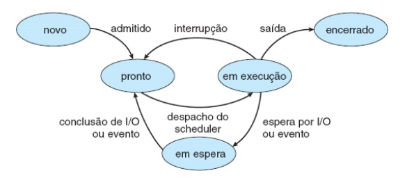

# Gerenciamento de Processos

  **Processo é um programa em execução**
  
  - PCB process control block
    - task struct (sched.h) no linux
      - pid
      - alocação de memória
      - arquivos abertos
      - segurança (dono do processo, grupo, privilégios)
      - accounting (contabilidade -> utilização de cpu, memória, disco, rede, ...)
      - estado dos registradores
    - estrutura de dados que armazena as informações de um processo
    - contexto: estado de um processo

## Ciclo de vida de um processo (questão de prova)
  - Novo
    - Cria struct e armazena todos os dados necessários
  - Pronto
    - fila de prontos
    - todos os processos prontos esperando para ganhar cpu
  - Exec
  - Espera|E/S
    - Fila leitura arquivo, pacote de rede, memória, ...
  - Finalizado (ou zombie -> processo terminou, mas ainda tem recursos alocados pois o SO vai tirando os dados aos poucos)
  - 3 e 6 não preemptiva
  - demais transições são preemptivas
  - DMA - Direct Memory Access
    - dispositivo de hardware entre a CPU e a memória

  

    
  

## Troca de contexto

  

    
  

## Escalonadores

  - curto prazo: decide qual processo vai ganhar a CPU (fila de prontos)
  - longo prazo: decide quais processos são armazenados na memória (SWAP)

## Escalonamento de Processos

  - Decidir qual processo vai ganhar a CPU
  - fila de prontos
  - métricas
    - tempo de execução (processamento)
      - Desejado: menor possível
    - tempo de espera (tempo na fila de prontos)
      - Desejado: menor possível
    - throughput (produtividade)
      - Desejado: maior possível 
      - quantidade de processos executados por unidade de tempo
      - Ex: quantos processos por hora eu finalizo
    - tempo de resposta
      - Desejado: menor possível
      - sistemas interativos

## Algoritmos de Escalonamento

**a) FCFS (first come, first served)**
  - Primeiro a chegar, primeiro a ser servido
  - fácil de implementar
  - Não preemptivo
  - Pontos Negativos
    - Efeito comboio
      - Processos grandes demoram muito para serem executados
      - Processos pequenos ficam esperando muito tempo

**b) Menor tarefa primeiro (SJS - shortest job first)**

  - Escolher a menor tarefa na fila de prontos
    - Tarefa com menor tempo de execução (tempo de CPU)
  - É a política com o menor tempo médio de espera -> **política ótima**
  - Teórico, usado como métrica de comparação quando se cria um escalonador

**b.1 Não Preemptiva**

| Processo | Tcpu | Tex | Tesp |
| -------- | ---- | --- | ---- |
| p0       | 10   | 21  | 11   |
| p1       | 5    | 11  | 6    |
| p2       | 3    | 3   | 0    |
| p3       | 3    | 6   | 3    |

**b.2 Preemptiva**

| **Processo** | **Tcpu** | **Tcheg** | **Tex** | **Tesp** |
|--------------|----------|-----------|---------|----------|
| p0           | 10       | 0         | 21      | 11       |
| p1           | 5        | 1         | 11      | 6        |
| p2           | 3        | 2         | 3       | 0        |
| p3           | 3        | 3         | 3       | 2        |

  - Executa **UMA** unidade de tempo e avalia novamente de acordo com todos os tempos na fila
    - considerando a chegada de novas tarefas
  - Preemptiva pq remove o processo da CPU, sem a necessidade de uma chamada de interrupção