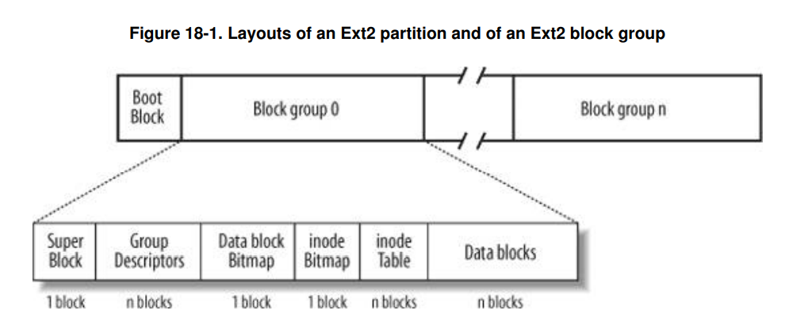

# EXT2 (Second Extended Filesystem)

1) Qual a estrutura de uma partição formatada em EXT2?\
   **R.:**
   
2) Qual a utilidade do super block? \
   **R.:** O Superblock contém todas as informações sobre o layout do sistema de arquivos e possivelmente contém outras informações importantes, como quais recursos opcionais foram usados para criar o sistema de arquivos.
   O Superblock está sempre localizado no byte 1024 desde o início do volume e tem exatamente 1024 bytes de comprimento.
3) Qual a utilidade do group descriptor?\
   **R.:** Descreve todos os dados de um block group.
4) Qual a utilidade do data bitmap?\
   **R.:** O bitmap de dados é um bitmap que indica quais blocos de dados estão em uso e quais estão livres.
5) Qual a utilidade do inode bitmap?\
   **R.:** O bitmap de inodes é um bitmap que indica quais inodes estão em uso e quais estão livres na inode table.
6) O que é um inode?\
   **R.:** Um inode é uma estrutura no disco que representa um arquivo, diretório, link simbólico, etc. Os inodes **não contêm os dados do arquivo**/diretório/etc. que eles representam. Eles tem um link para o bloco cujo dado está armazenado. Cada lbock group tem um array de inodes.

## Lendo arquivo floppyext2.img

### **Superbloco**

**total_inodes** = 5016\
**total_blocks** = 20000\
**block_number_SB** = 1\
**block_size** = 1024 (1024 << n -> n == 0)\
**blocks_per_group** = 8192\
**inodes_per_group** = 1672 => Quantidade de entradas no inode table

Quantidade de block groups: 3

### **Group Descriptor**

**group_descriptor_begin** = 1024\
**block_bitmap_addr** = 81\
**inode_bitmap_addr** = 82\
**inode_table_addr** = 83

o primeiro inode é o 1\
Root dir é sempre o inode 2

**direct_block_pointer_0** = 0x00000124\
**direct_block_pointer_1** = 0x00000000

0 Significa que não tem mais nada alocado

### **Entradas no root dir**

**Entrada 1**\
end -> 0x49000\
inode -> 0x00000002\
entry_total_size -> 0x000C\
name_lenght -> 0x01\
type -> 0x02\
name -> "."

**Entrada 2**\
end -> 0x4900C\
inode -> 0x00000002\
entry_total_size -> 0x000C\
name_lenght -> 0x02\
type -> 0x02\
name -> ".."

**Entrada 3**\
end -> 0x49018\
inode -> 0x0000000B\
entry_total_size -> 0x0014\
name_lenght -> 0x0A\
type -> 0x02\
name -> "lost+found"

**Entrada 4**\
end -> 0x4902c\
inode -> 0x00000689\
entry_total_size -> 0x000C\
name_lenght -> 0x03\
type -> 0x02\
name -> "sub"

**Entrada 5**\
end -> 0x49038\
inode -> 0x0000000C\
entry_total_size -> 0x0014\
name_lenght -> 0x09\
type -> 0x01\
name -> "Teste.txt"

**Entrada 6**\
end -> 0x4904c\
inode -> 0x0000068B\
entry_total_size -> 0x000C\
name_lenght -> 0x04\
type -> 0x02\
name -> "sub1"

**Entrada 7**\
end -> 0x49058\
inode -> 0x0000000D\
entry_total_size -> 0x03A8\
name_lenght -> 0x0A\
type -> 0x01\
name -> "Teste2.txt"

**Inode table de Teste.txt**
end -> 0x14C00 + 80 * B => 0x15180\
file_size -> 0x0000044F\
pointer_block_0 -> 0x00000201\
pointer_block_1 -> 0x00000202

começa em 0x80400
começa em 0x80800