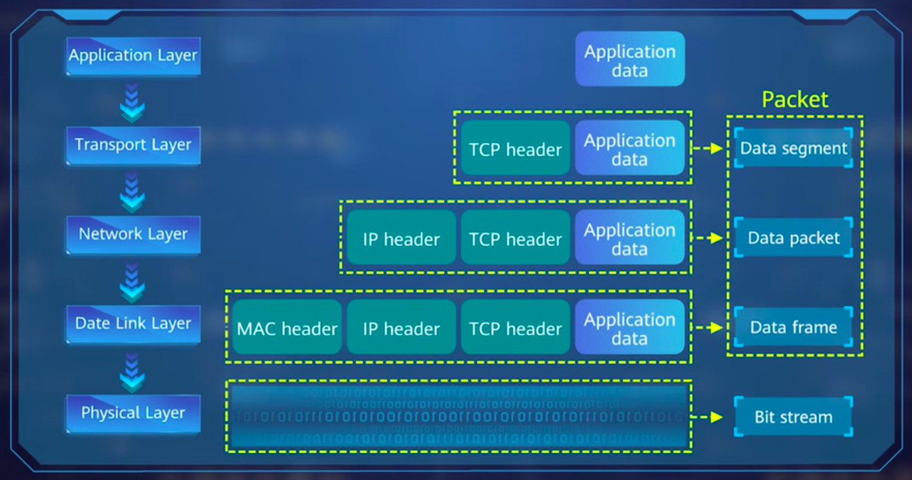
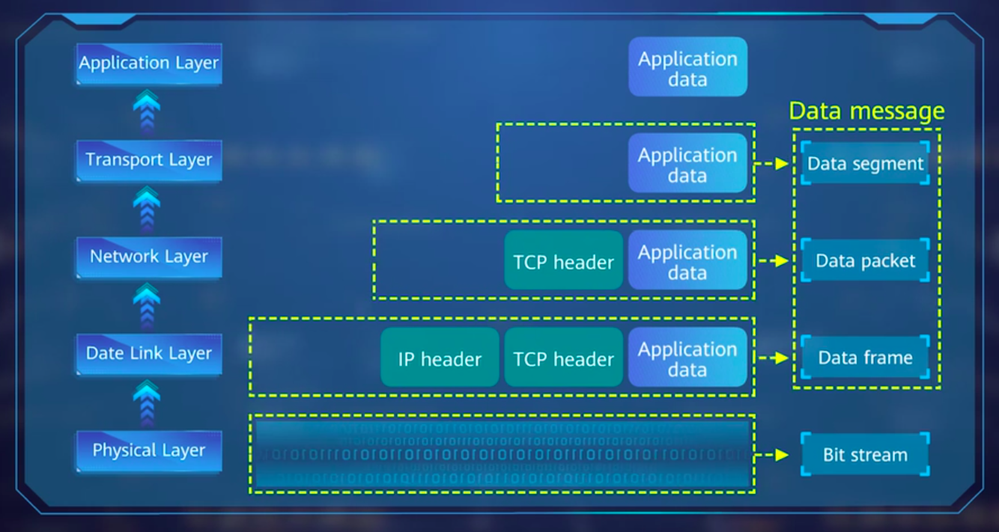

# Basics of Computer Network

## Dúvidas

  - O que é overwatching?
    - R: 

## Overview

  - Conceitos básicos
  - Classificação
  - Arquitetura
  - Encapsulamento de dados
  - Layered System Architecture
  - Transmissão de dados (sending and receiving)

  **O que é um network?**
  - Conexão de multiplos computadores através de links de comunicação
  - Compartilhamento de recursos e informação
  - O network mais siples contém duas máquinas e um link de comunicação
  - O maior network é a internet
  - Para conectar multiplos computadores, é necessário um protocolo de comunicação.
    -  O protocolo de comunicação é um conjunto de regras que define como os dados são transmitidos entre os computadores.

  **Classificação de Networks**
  - Client-server mode - C/S network
  - Peer to Peer - P2P network
  - Browser/Server - B/S network
  - Hybrid network

  **Networks Nodes Distribuition Ranges**
  - Local Area Network - LAN
    - Nomrlamente distância menor de 10km
    - Baseada em Network Sharing Service Mode 
  - Metropolitan Area Network - MAN
    - Entre 10 e 100km
  - Wide Area Network - WAN
    - mais de 1000 km
    - Internet
    - Composta por multiplas LANs e MANs interconectadas

## Layers

  Normalmente divide-se em diferente layers para facilitar a compreensão

  **Vantagens:**
  - Simplifica sistemas complexos em layer-by-layer para análise
  - Resolve problemas de overwatching
  - Desenvolver padrões específicos de layers torna a compreensão e revisão mais fáceis
  - Engenheiros conseguem se concentrar em desenvolver funções para cada layer esécífica sem se preocupar com outras layers
  - Melhora a escalabilidade
    - A extensão de uma layer não afeta outras layers
    - Deixa o network mais robusto
  - Fácil manutenção e modificação
    - Garante estabilidade 
  
  
  ISO (International Organization for Standardization) propôs Open System Interconnection (OSI) reference model

  **OSI Reference Model (7 layers)**
  - Application Layer
    - Interface entre serviços do network e usuário final
  - Presentation Layer
    - Formatação de dados
    - Criptografia
    - Compressão
  - Session Layer
    - Estabelece, gerencia e termina conexões entre os hosts
  - Transport Layer
    - protocolo e número da porta para transmissão de dados
    - Controle de fluxo
    - Controle de erros
  - Network Layer
    - Endereçamento lógico
    - Roteamento (route/path selection) entre diferentes networks
  - Data Link Layer
    - Estabele conexões lógicas
    - Endereçamento físico
    - Correção de erros
  - Physical Layer
    - Estabelece, mantém e termina conexões físicas
    - Todas as informações são transmitidas através da layer física

  As layers de Apresentação e sessão são raramente usadas em aplicações, pois são combinadas na layer de aplicação, simplificando o sistema de 7 camadas para 5 camadas.

## Data Transmission

  Nas 5 camadas da internet o envio é feito através do encapsulamento de dados

  **Encapsulamento/Envio de dados**
  - Application Layer
    - Os dados do usuário são adicionados ao cabeçalho da layer de aplicação
    - ApplicationData = UserData + ApplicationLayerProtocol (header)
  - Transport Layer
    - ApplicationData é adicionado ao cabeçalho da layer de transporte (TCP)
    - DataSegment = ApplicationData + TCPHeader
    - DataSegment é um pacote
  - Network Layer
    - DataSegment é adicionado ao cabeçalho da layer de rede (IP)
    - DataPacket = DataSegment + IPHeader
  - Data Link Layer
    - DataPacket é adicionado ao cabeçalho da layer de link de dados (MAC)
    - DataFrame = DataPacket + MACHeader
  - Physical Layer
    - bit stream
    - Provê as funções da data link layer e da physical layer
    - Antes de ser transmitida à internet card, é adicionada ao internet header

  

    
  

  **Recebimento de dados**
  - Desempacotar layer por layer, iniciando pelo internet card
  - **Processo Inverso do Envio**

  - Physical Layer
    - Lê os dados através do network adapter e envia para a data link layer
  - Data Link Layer
    - Endereço físico, frame header, frame trailer e check code são removidos do DataFrame, formando o DataPacket
    - Se o MACHeader for válido, envia para a network layer
  - Network Layer
    - Ip address no packet header é comparado com o ip address do local host
      - Se forem iguais o IPHeader é removido e o DataSegment é enviado para a transport layer
      - Se forem diferentes, e o pacote **não** for um broadcast, o packet é descartado
  - Transport Layer
    - Extrai o control information, como packet sequence number
    - Remove o header information (TCP header)
    - Monta o data segment, gerando o ApplicationData, de acordo com o packet sequence number
  - Application Layer
    - Extrai o ApplicationData e envia para a aplicação

  

    
  

