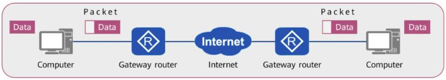
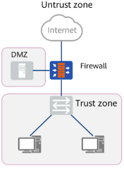
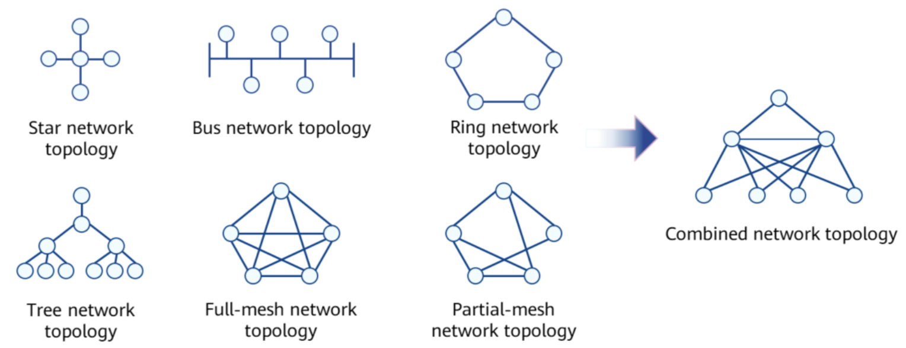

# Network Basis

  - Comunicação -> Transferência de infomação entre pessoas ou coisas
  - Network communication -> Transferência de informação entre dispositivos através de uma rede

## Information Transfer Process

  - Parecido com transferência de objetos físicos

  

## Equipamentos

  **Switches**
  - Link layer device (layer 2)
  - Acesso entre máquinas na mesma rede
  - Acesso entre máquinas - servidores

  **Router**
  - Network layer device (layer 3)
  - Envio de pacotes de dados na internet
  - Encontrar o caminho correto para o pacote em questão
    - Através do endereço IP do destino
  - Isolar uma rede interna de outra rede interna

  **Firewall**
  - Network security device
  - Proteger uma zona de confiança de uma zona não confiável
  - Provê diferentes funções
    - Controle de acesso
    - User identity autentication
    - Remote access
    - Data encryption
    - VPN service
    - Network address translation (??)
  
  

  **Wireless devices**
  - Wireless
  - Fat AP architecture
    - Comumente usado em casa
    - há um roteador wireless
  - Access Controler
    - Usado em empresas/grandes centros
    - Gerenciar multiplos AP
    - Como não há muitas funções de gerenciamento, chama-se de "fit AP"

## Network Types

  - LAN - Local Area Network
  - MAN - Metropolitan Area Network (cidades)
  - WAN - Wide Area Network (internet)

## Topology Types

  - Star topology
  - Bus topology
    - Pontos negativos:
      - Se dois dispositivos estão se comunicando, então o barramento está ocupado, então os outros nós não podem se comunicar
  - Ring topology
    - Pontos negativos:
      - Confiabilidade
      - Se um link está quebrado, é necessário passar por muitos outros nós para chegar ao destino
  - Full-mesh topology
    - Mais robusto
    - se um link está quebrado, ainda é possível se comunicar através dos demais nós
    - Entretanto, são muitos links, o que encarece a estrutura
  - Partial-mesh topology
  - Combined topology
  
  

