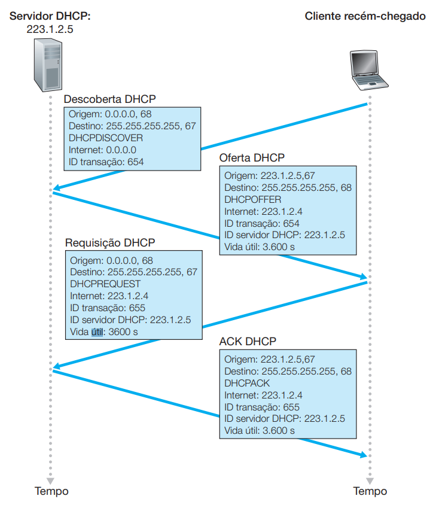

# Exercícios - Camada de Rede

1) Vamos rever um pouco da terminologia usada neste livro. Lembre-se de que o nome de um pacote de camada de transporte é segmento e que o nome de um pacote de camada de enlace é quadro. Qual é o nome de um pacote de camada de rede? Lembre-se de que roteadores e comutadores de camada de enla- ce são denominados comutadores de pacotes. Qual é a diferença fundamental entre um roteador e um comutador de camada de enlace? Lembre-se de que usamos o termo roteadores tanto para redes de data- gramas quanto para redes de CVs.\
  **R.:** O nome de um pacote de camada de rede é datagrama.
  A diferença fundamental entre um roteador e um comutador de camada de enlace é que o roteador opera na camada de rede do modelo OSI e toma decisões de encaminhamento de pacotes com base em endereços IP. Ele determina o melhor caminho para enviar o pacote para o destino, usando informações em sua tabela de roteamento.\
  Por outro lado, um comutador de camada de enlace, como um switch Ethernet, opera na camada de enlace do modelo OSI e toma decisões de encaminhamento de pacotes com base nos endereços MAC. Ele usa informações em sua tabela de comutação para encaminhar o pacote para o destino correto.\
  Em resumo, enquanto um roteador é projetado para encaminhar pacotes entre redes diferentes, um comutador de camada de enlace é projetado para encaminhar pacotes dentro de uma única rede local.

2) Quais são as duas funções mais importantes de camada de rede em uma rede de datagramas? Quais são as três funções mais importantes de camada de rede em uma rede com circuitos virtuais?\
  **R.:** As duas funções mais importantes da camada de rede em uma rede de datagramas são o roteamento de pacotes e o encapsulamento de pacotes.
  - Roteamento de pacotes: a camada de rede determina o melhor caminho para enviar um pacote do host de origem para o host de destino, com base no endereço IP de destino. Ela usa informações em sua tabela de roteamento para tomar essa decisão e encaminhar o pacote para o próximo nó da rede.
  - Encapsulamento de pacotes: a camada de rede encapsula o pacote de camada de transporte em um pacote de camada de rede, adicionando um cabeçalho de camada de rede ao pacote. Esse cabeçalho inclui o endereço IP de origem e o endereço IP de destino do pacote.
  
  Em uma rede com circuitos virtuais, as três funções mais importantes da camada de rede são:
  - Estabelecimento de conexões de circuito virtual: a camada de rede estabelece conexões de circuito virtual entre dispositivos finais antes que os dados sejam transmitidos. Cada conexão é identificada por um número de circuito virtual e é usada para encaminhar os pacotes de dados ao longo do caminho correto.
  - Roteamento de circuito virtual: a camada de rede determina o melhor caminho para encaminhar os pacotes de dados ao longo do circuito virtual, com base no número de circuito virtual.
  - Liberação de circuito virtual: a camada de rede libera as conexões de circuito virtual quando não são mais necessárias. Essa liberação de recursos permite que a rede reutilize os recursos para outras conexões de circuito virtual.
  
  Em uma rede com circuitos virtuais, as três funções mais importantes da camada de rede são:

  - Estabelecimento de conexões de circuito virtual: a camada de rede estabelece conexões de circuito virtual entre dispositivos finais antes que os dados sejam transmitidos. Cada conexão é identificada por um número de circuito virtual e é usada para encaminhar os pacotes de dados ao longo do caminho correto.

  - Roteamento de circuito virtual: a camada de rede determina o melhor caminho para encaminhar os pacotes de dados ao longo do circuito virtual, com base no número de circuito virtual.

  - Liberação de circuito virtual: a camada de rede libera as conexões de circuito virtual quando não são mais necessárias. Essa liberação de recursos permite que a rede reutilize os recursos para outras conexões de circuito virtual.

3) Qual é a diferença entre rotear e repassar (transmitir)?\
  **R.:** Roteamento refere-se ao processo de determinar a melhor rota para encaminhar um pacote de dados da origem ao destino, com base em informações de roteamento como tabelas de roteamento e algoritmos de roteamento. O roteamento é feito por roteadores, que examinam o cabeçalho do pacote e tomam decisões de roteamento com base nas informações contidas nele, como endereços IP, máscaras de sub-rede e informações de interface de rede.\
  Por outro lado, o repasse (ou transmissão) refere-se ao ato de encaminhar um pacote de dados da origem ao próximo nó ao longo do caminho de transmissão. Em uma rede de datagramas, como a Internet, cada pacote é transmitido de forma independente e pode seguir caminhos diferentes, dependendo das condições da rede e das decisões de roteamento tomadas pelos roteadores ao longo do caminho. Em uma rede com circuitos virtuais, o pacote deve seguir o caminho pré-definido pelo circuito virtual estabelecido anteriormente.\
  Assim, enquanto o roteamento envolve a tomada de decisões sobre a melhor rota para um pacote, o repasse (ou transmissão) é o ato físico de encaminhar o pacote para o próximo nó ao longo do caminho de transmissão. O repasse é executado por comutadores (como switches de camada de enlace) ou roteadores, que enviam os pacotes para a próxima interface de rede na direção do destino.

4) Os roteadores de redes de datagramas e de redes de circuitos virtuais usam tabelas de repasse? Caso usem, descreva as tabelas de repasse para ambas as classes de redes.\
  **R.:** Sim, tanto os roteadores de redes de datagramas quanto os roteadores de redes de circuitos virtuais utilizam tabelas de repasse (também conhecidas como tabelas de roteamento) para encaminhar os pacotes de dados de um nó da rede para outro.
  - roteadores de redes de datagramas para determinar a melhor rota a ser tomada para encaminhar um pacote de dados. Cada entrada na tabela de repasse corresponde a um possível destino de pacote e contém informações sobre como encaminhar pacotes para esse destino.Essa tabela repasse geralmente é criada e mantida automaticamente pelo protocolo de roteamento, que usa informações sobre as redes vizinhas e os links entre os roteadores para calcular a melhor rota para cada destino. Cada entrada na tabela de repasse pode conter várias informações, como o endereço de destino, o próximo salto a ser tomado, o custo do caminho, o número da interface de saída e a métrica.\
  A entrada na tabela de repasse para um determinado destino geralmente contém o endereço IP do destino e a máscara de sub-rede que especifica a rede à qual o destino pertence.
  - A tabela de repasse em redes de circuitos virtuais é uma estrutura de dados que contém informações necessárias para estabelecer, manter e terminar conexões de circuitos virtuais entre os nós da rede. Diferentemente de redes de datagramas, as redes de circuitos virtuais estabelecem um caminho dedicado para a comunicação entre os nós antes que os dados comecem a ser transmitidos. Cada entrada na tabela de repasse em redes de circuitos virtuais contém informações sobre o circuito virtual específico, incluindo o identificador de circuito virtual, o endereço de rede de origem, o endereço de rede de destino, a largura de banda solicitada e a rota a ser usada para encaminhar os dados.\
  Ao receber um pacote de dados, o roteador consulta a tabela de repasse para identificar o circuito virtual correspondente. Em seguida, o roteador encaminha o pacote para o próximo nó no caminho do circuito virtual, de acordo com a rota estabelecida na tabela de repasse. A tabela de repasse em redes de circuitos virtuais é atualizada sempre que um novo circuito virtual é estabelecido, um circuito virtual é terminado ou quando as condições da rede mudam, como mudanças na largura de banda ou rota.

8) 3 tipos de elementos de comutação são discutidos na seção 4.3. Cite e descreva cada tipo.\
  **R.:** 
  - Comutação através da memória: pacote é copiado da porta de entrada para memoria do processador ele extrai o endereço de destino do cabeçalho entao copia o pacote para buffer de saída;
  - Comutação por barramento: as portas de entradas transferem um pacote diretamente para a porta de saída por um barramento compartilhado sem intervenção do processador de roteamento, somente um pacote é transferido por barramento;
  - Comutação por uma rede de interconexão: é utilizada para para vencer a limitação da largura na banda de um barramento único compartilhado.

9) Descreva como pode ocorrer perda de pacotes em portas de entrada. Descreva como a perda de pacotes pode ser eliminada em portas de entrada (sem usar buffers infinitos).\
  **R.:** Pode ocorrer devido a fatores como congestionamento, erros de transmissão ou falhas no hardware. Quando a porta de entrada de um dispositivo de rede recebe pacotes em excesso, além da capacidade de processamento da porta, pode ocorrer congestionamento.\
  Pode-se usar técnicas como o controle de congestionamento ou como a retransmissão de pacotes perdidos. No controle de congestionamento os dispositivos de rede limitam a taxa de transmissão de pacotes para evitar congestionamento na porta de entrada. 
  **Professor:** Estourar TTL, Erro de transmissão

10) Descreva como pode ocorrer perda de pacotes em portas de saída.\
  **R.:** A perda de pacotes em portas de saída ocorre quando uma porta de saída recebe mais pacotes do que pode transmitir, assim a memória do buffer de saída do roteador fica saturada e esses pacotes são descartados.
  **Professor:** Pacote bloquando a saída da fila do buffer de saída

11) O que é bloqueio HOL? Ele ocorre em portas de saída ou em portas de entrada?\
  **R.:** É um bloqueio de cabeça de fila, que ocorre quando um pacote bloqueia a transmissão de todos os pacotes que estão atrás dele na fila de espera por ter sofrido um bloqueio por disputa de porta. Isso ocorre em portas de saída.

12) Roteadores têm endereços IP? Em caso positivo, quantos endereços eles têm?\
  **R.:** Sim, roteadores possuem endereços IP. Eles possuem um endereço IP válido para cada interface que compreende.

13) Qual é o equivalente binário de 32 bits para o endereço IP 223.1.3.27?\
  **R.:** 11011111 00000001 00000011 00011011

14) Visite um hospedeiro que usa DHCP para obter seu endereço IP, máscara de rede, roteador de default e endereço IP de seu servidor DNS local. Faça uma lista desses valores.\
  **R.:** 
    
    **Professor:** IP, máscara de rede, DNS (usar DHCP para configurar), default gateway

15) Suponha que haja três roteadores entre os hospedeiros da fonte e do destino. Ignorando a fragmentação, um datagrama IP enviado do hospedeiro da fonte até o hospedeiro do destino transitará por quantas interfaces? Quantas tabelas de repasse serão indexadas para deslocar o datagrama desde a fonte até o destino?\
  **R.:** 3 tabelas de repasse (1 para cada roteador) e 8 interfaces (2 para cada roteador, uma para o hospedeiro e uma para o destino).

16) Suponha que uma aplicação gere blocos de 40 bytes de dados a cada 20 milissegundos e que cada bloco seja encapsulado em um segmento TCP e, em seguida, em um datagrama IP. Que porcentagem de cada datagrama será sobrecarga e que porcentagem será dados de aplicação?\
  **R.:** Um cabeçalho IP tem 20 bytes e um cabeçalho TCP tem 20 bytes. Portanto, 40 bytes de dados são encapsulados em 40 bytes de cabeçalhos. Portanto, 40/80 = 50% de cada datagrama será sobrecarga e 50% será dados de aplicação.

17) Suponha que o Hospedeiro A envie ao Hospedeiro B um segmento TCP encapsulado em um datagrama IP. Quando o Hospedeiro B recebe o datagrama, como a camada de rede no Hospedeiro B sabe que deve passar o segmento (isto é, a carga útil do datagrama) para TCP e não para UDP ou qualquer outra coisa?\
  **R.:** Utiliza-se o campo _protocolo da camada superior_ do cabeçalho IP para identificar a camada de transporte.

18) Suponha que você compre um roteador sem fio e o conecte a seu modem a cabo. Suponha também que seu ISP designe dinamicamente um endereço IP a seu dispositivo conectado (isto é, seu roteador sem fio). Suponha ainda que você tenha cinco PCs em casa e que usa 802.11 para conectá-los sem fio ao seu roteador também sem fio. Como são designados endereços IP aos cinco PCs? O roteador sem fio usa NAT?\
  **R.:** Quando o roteador sem fio é conectado ao modem a cabo, ele é designado com um endereço IP dinamicamente pelo ISP. Este endereço IP é o endereço IP público do roteador, que é usado para identificá-lo na Internet. Os PCs em casa são conectados ao roteador sem fio usando a tecnologia 802.11, que é uma forma de conexão sem fio.\
  O roteador sem fio pode usar um protocolo de alocação de endereço IP chamado DHCP (Dynamic Host Configuration Protocol) para atribuir um endereço IP a cada PC em casa. O DHCP é capaz de fornecer endereços IP exclusivos para cada dispositivo em uma rede. Portanto, cada PC conectado ao roteador sem fio pode ser designado com um endereço IP diferente.
  **Professor:** Roteador recebe um IP do ISP e tem o ip da rede local (para a sub-rede da interface sem fio). Para os PCs conectados ao roteador, o DHCP atribui um IP da rede local.Sim, o roteador usa NAT (O NAT traduz o endereço IP público do roteador para o endereço IP privado da rede local).

19) Compare os campos de cabeçalho do IPv4 e do IPv6 e aponte suas diferenças. Eles têm algum campo em comum?\
  **R.:** As semelhanças entre os cabeçalhos são o endereço de origem, o endereço de destino, a verificação de integridade do cabeçalho (checksum no IPv4 e campo de integridade no IPv6), o campo Time to Live (TTL) e o campo Protocolo. 
  As diferenças são:
  - O cabeçalho do IPv4 tem um tamanho fixo de 20 bytes, enquanto o cabeçalho do IPv6 tem um tamanho fixo de 40 bytes;
  - Endereçamento: O IPv4 usa endereços de 32 bits, enquanto o IPv6 usa endereços de 128 bits;
  - Tipo de serviço (ToS): O campo ToS no IPv4 foi substituído pelo campo Traffic Class no IPv6;
  - Identificação: O campo Identification do IPv4 é usado para identificar pacotes fragmentados, enquanto o IPv6 não fragmenta pacotes. Portanto, o campo Identification foi removido do cabeçalho IPv6;
  - Fragmentação: O IPv4 suporta fragmentação de pacotes, enquanto o IPv6 não suporta. Portanto, os campos relacionados à fragmentação (Flag, Fragment Offset) foram removidos do cabeçalho IPv6;

21) Compare e aponte as diferenças entre os algoritmos de estado de enlace e de vetor de distâncias.\
  **R.:** O algoritmo de estado de enlace é baseado na ideia de que cada roteador da rede tem uma imagem completa da topologia da rede, incluindo o custo de cada enlace. Cada roteador usa essas informações para construir um mapa completo da rede e determinar a melhor rota para encaminhar pacotes. Os roteadores enviam informações sobre seus vizinhos e links para todos os outros roteadores na rede. Cada roteador armazena essas informações em uma tabela de encaminhamento, que é atualizada periodicamente ou quando ocorrem mudanças na topologia da rede. O algoritmo de estado de enlace é mais complexo do que o algoritmo de vetor de distâncias, mas pode levar a rotas mais eficientes e estáveis em redes grandes e complexas.\
  O algoritmo de vetor de distâncias é mais simples do que o algoritmo de estado de enlace. Cada roteador mantém uma tabela de roteamento que lista a distância para cada destino na rede e a próxima porta de saída a ser usada para alcançar esse destino. Cada roteador atualiza periodicamente sua tabela de roteamento com informações dos roteadores vizinhos. O roteador envia sua tabela de roteamento atualizada para seus vizinhos, que por sua vez atualizam suas próprias tabelas. O algoritmo de vetor de distâncias é menos preciso do que o algoritmo de estado de enlace, mas é mais fácil de implementar e requer menos recursos de processamento e memória.\
  Em resumo, as principais diferenças entre os algoritmos de estado de enlace e de vetor de distâncias são:\
  - O algoritmo de estado de enlace usa uma imagem completa da topologia da rede, enquanto o algoritmo de vetor de distâncias usa informações limitadas de seus vizinhos;
  - O algoritmo de estado de enlace é mais complexo e consome mais recursos de processamento e memória do que o algoritmo de vetor de distâncias;
  - O algoritmo de estado de enlace pode levar a rotas mais eficientes e estáveis em redes grandes e complexas, enquanto o algoritmo de vetor de distâncias é mais adequado para redes menores e mais simples.

23) É necessário que todo sistema autônomo use o mesmo algoritmo de roteamento intra-AS? Justifique sua resposta.\
  **R.:** É necessário que todo sistema autônomo use o mesmo algoritmo de roteamento intra-AS? Justifique sua resposta.

27) Por que são usados protocolos inter-AS e intra-AS diferentes na Internet?\
  **R.:** 

28) Por que considerações políticas não são tão importantes para protocolos intra-AS como o OSPF e o RIP, quanto para um protocolo de roteamento inter-AS como BGP?\
  **R.:** As considerações políticas são menos importantes para os protocolos intra-AS, como OSPF e RIP, porque eles são usados dentro de um único sistema autônomo (AS), que é administrado por uma única entidade. Por outro lado, o protocolo BGP é usado para trocar informações de roteamento entre diferentes ASs. Como diferentes ASs são gerenciados por diferentes entidades, pode haver considerações políticas e econômicas envolvidas na tomada de decisões de roteamento.

33) Para cada uma das três abordagens gerais que estudamos para a comunicação broadcast (inundação não controlada, inundação controlada e broadcast de spanning tree), as seguintes declarações são verdadeiras ou falsas? Você pode admitir que não há perda de pacotes devido ao transbordamento do buffer e que todos os pacotes são entregues em um enlace na ordem em que foram enviados.\
  a) Um nó pode receber várias cópias do mesmo pacote.\
      Inundação não controlada - V\
      Inundação controlada - V\
      Spanning tree - F\
  b) Um nó pode repassar várias cópias de um pacote pelo mesmo enlace de saída.\
      Inundação não controlada - V\
      Inundação controlada - F\
      Spanning tree - F

34) Quando um hospedeiro se junta a um grupo multicast, ele deve mudar seu endereço IP para o endereço do grupo multicast ao qual está se juntando?
  **R.:** Não, quando um hospedeiro se junta a um grupo multicast, ele não muda seu endereço IP para o endereço do grupo multicast. Em vez disso, o hospedeiro mantém seu endereço IP atual e é atribuído um endereço multicast especial para o grupo ao qual se juntou. Esse endereço multicast especial é usado para enviar e receber tráfego de multicast para o grupo em questão.\
  Na rede, um roteador de multicast é responsável por encaminhar pacotes de multicast para os hosts que se juntaram ao grupo correspondente. Quando um pacote de multicast é enviado para um grupo multicast, o endereço IP de destino do pacote é o endereço multicast especial do grupo e não o endereço IP de nenhum host específico que tenha se juntado ao grupo.

## Parte 2

3) Uma tabela de repasse bem básica em uma rede de CVs tem quatro colunas. O que significam os valores em cada uma dessas colunas? Uma tabela de repasse bem básica em uma rede de datagramas tem duas colunas. O que significam os valores em cada uma dessas colunas?
  **R.:** A tabela de repasse em uma rede de circuitos virtuais possui quatro colunas, que são:\
  - Interface de entrada: a interface na qual o pacote chegou ao roteador.
  - Nº do CV de entrada: o número do circuito virtual pelo qual o pacote chegou ao roteador.
  - Interface de saída: a interface pela qual o pacote deve ser enviado para chegar ao próximo roteador ou ao destino final.
  - Nº do CV de saída: o número do circuito virtual que deve ser usado para encaminhar o pacote para a interface de saída correspondente.\
  Assim, a tabela de repasse é usada pelo roteador para encaminhar os pacotes pelo caminho pré-determinado estabelecido pelos circuitos virtuais. Quando um pacote chega a um roteador, ele é encaminhado para a interface de saída especificada na tabela de repasse correspondente ao circuito virtual pelo qual ele entrou no roteador.

### **Roteamento de pacotes**
O roteamento de pacotes é uma das funções mais importantes da camada de rede em uma rede de datagramas. Ele é responsável por determinar o melhor caminho para enviar um pacote do host de origem para o host de destino, com base no endereço IP de destino do pacote.

Quando um pacote é enviado de um host para outro, ele pode precisar passar por vários nós intermediários (roteadores) antes de chegar ao seu destino final. Cada nó intermediário examina o cabeçalho de camada de rede do pacote para determinar o próximo salto na rota para o destino. O roteador faz isso comparando o endereço de destino do pacote com sua tabela de roteamento para descobrir qual é o próximo salto a ser tomado.

A tabela de roteamento de um roteador contém informações sobre como alcançar outras redes e hosts na internet. Cada entrada na tabela de roteamento inclui uma rede de destino, uma máscara de sub-rede, o endereço IP do próximo salto e uma interface de saída. Quando um pacote chega ao roteador, ele usa o endereço de destino do pacote e a máscara de sub-rede para encontrar a entrada correspondente na tabela de roteamento. Em seguida, o roteador usa o endereço IP do próximo salto para enviar o pacote ao próximo nó intermediário na rota para o destino.

O roteamento de pacotes é uma função crítica da camada de rede em uma rede de datagramas, pois permite que os pacotes sejam entregues aos seus destinos corretos, independentemente da topologia da rede. Sem o roteamento de pacotes, os pacotes não poderiam ser enviados de forma confiável pela internet.

### **Encapsulamento de pacotes**
O cabeçalho de camada de rede contém informações importantes sobre o pacote, como o endereço IP de origem e o endereço IP de destino. Essas informações permitem que os roteadores ao longo do caminho encontrem o caminho correto para encaminhar o pacote para o destino final.

O processo de encapsulamento começa quando o pacote de camada de transporte é passado para a camada de rede. A camada de rede adiciona um cabeçalho de camada de rede ao pacote e, em seguida, passa o pacote encapsulado para a camada de enlace de dados para que possa ser transmitido pela rede.

O cabeçalho de camada de rede contém várias informações importantes, como o endereço IP de origem e o endereço IP de destino, o comprimento do pacote e um campo de verificação de integridade. Essas informações são usadas pelos roteadores para determinar o caminho correto para encaminhar o pacote e para garantir que o pacote chegue ao seu destino final sem erros.

## Revisão 

3 Principais funções da camada de rede

1) Endereçamento de hosts
2) Roteamento de pacotes
3) Encaminhamento de pacotes

Na camada de transporte é chamado de pacote, na camada de rede é chamado de datagrama.